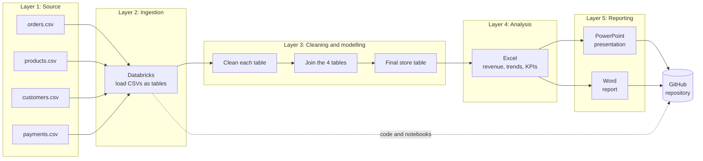
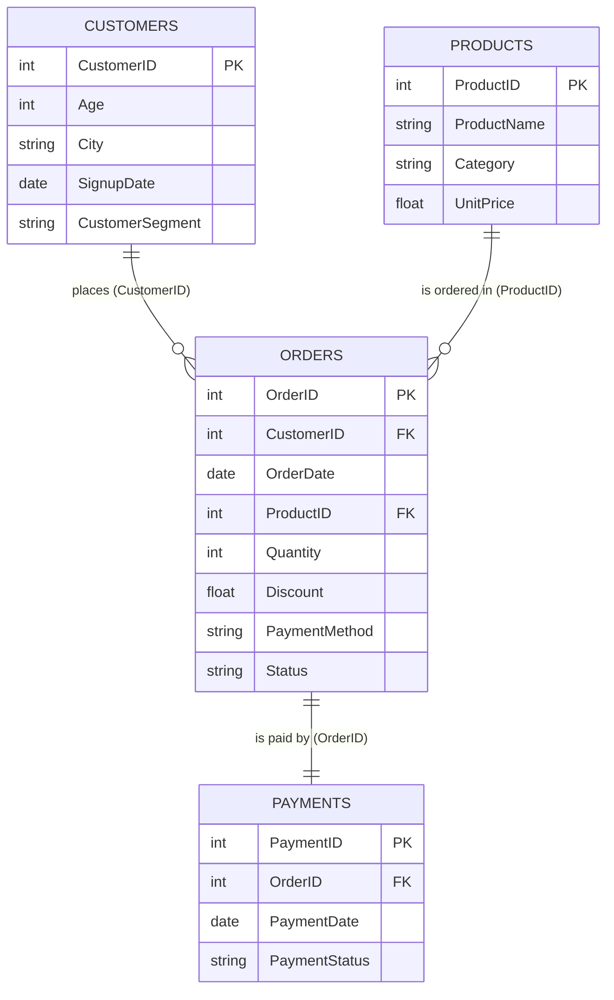
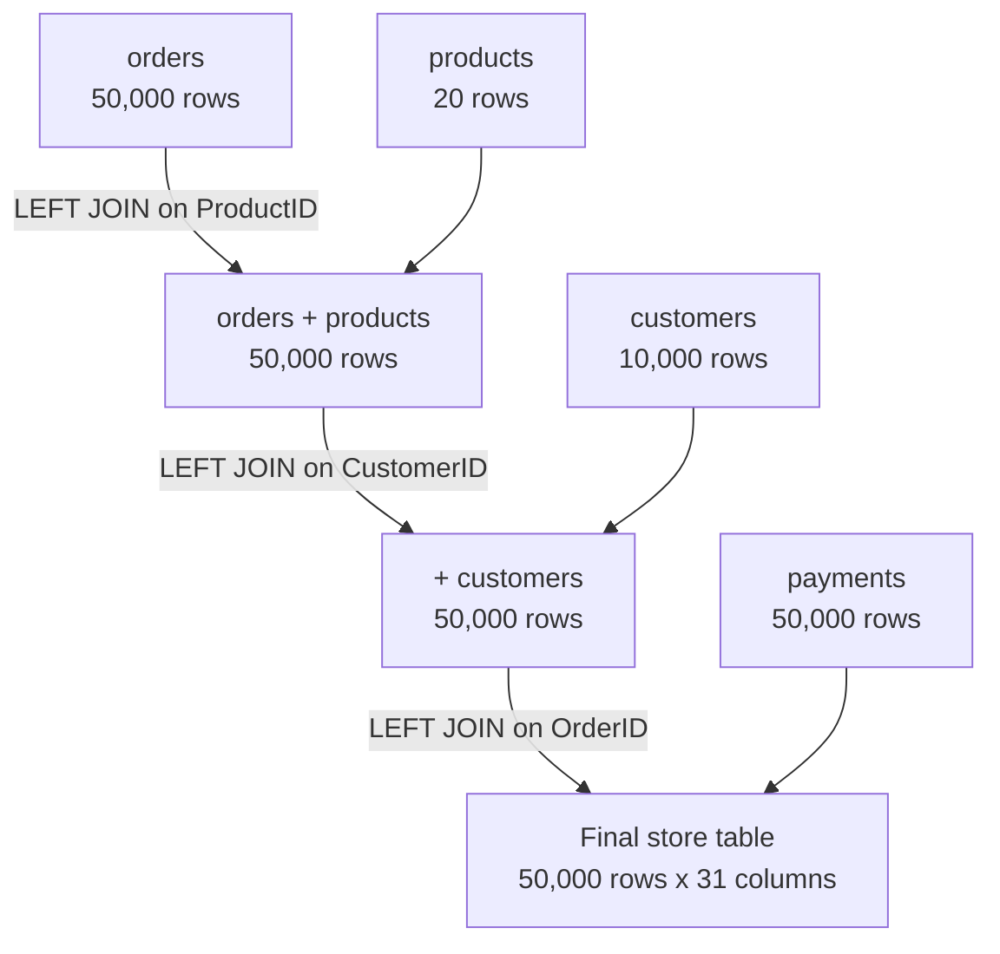

<p align="center">
  
</p>

# Bright Store Analysis: How Is the Shop Performing?

An end-to-end data analysis of an online electronics shop, from raw CSV files to a business presentation and report. The project answers one question for the Head of Operations: **how has the shop performed between January 2024 and June 2026, and what should it do next?**


> **Status:** work in progress. Sections marked *(to be updated)* will be completed when the full code is added.

---

## Table of Contents

1. [Project Overview](#1-project-overview)
2. [Pipeline Layers](#2-pipeline-layers)
3. [Data Sources and Schemas](#3-data-sources-and-schemas)
4. [Schema Flow](#4-schema-flow)
5. [Data Cleaning](#5-data-cleaning)
6. [How the Calculations Were Made](#6-how-the-calculations-were-made)
7. [Analysis and Results](#7-analysis-and-results)
8. [Recommendations](#8-recommendations)
9. [Data Limitations](#9-data-limitations)
10. [Tools and Technologies](#10-tools-and-technologies)
11. [Repository Structure](#11-repository-structure)
12. [How to Reproduce](#12-how-to-reproduce)
13. [Update Log](#13-update-log)

---

## 1. Project Overview

### The scenario
An online shop sells electronics, accessories, wearables, home-office items, stationery and gaming products. The Head of Operations is not a data person, so they need simple numbers, clear charts and plain-language explanations.

### Business questions answered
1. How much revenue did the shop make, from how many orders, and what is the average order value?
2. Is revenue growing, shrinking or flat month by month? Are there seasonal peaks?
3. Which products and categories bring in the most revenue, and which sell the most units?
4. Which cities and customer segments (New, Regular, VIP) are most valuable?
5. What share of orders are cancelled or returned, and what share of payments fail? Do some payment methods fail more?
6. Do bigger discounts lead to bigger orders, or just lower revenue?

### Deliverables

| Deliverable | Tool | Purpose |
|---|---|---|
| Cleaned and merged dataset | Databricks | One analysis-ready table |
| Analysis workbook | Excel | Pivot-style summaries, formulas and charts |
| Presentation | PowerPoint | Findings and three recommendations |
| Written report | Word | Method, results and data notes |
| Project repository | GitHub | Version control and documentation |

### Headline numbers

| Measure | Value |
|---|---|
| Orders (all statuses) | 50,000 |
| Realised orders (Completed and Paid) | 42,849 |
| Gross revenue | R3,503,500 |
| **Net revenue (Completed and Paid)** | **R2,998,463** |
| Average order value (net) | R69.98 |
| Units sold (net) | 80,698 |
| Cancelled or returned orders | 8.0% |
| Failed payments | 3.85% |

*All amounts are in South African Rand (ZAR, shown as R).*

[Back to top](#table-of-contents)

---

## 2. Pipeline Layers



| Layer | What happens | Tool |
|---|---|---|
| 1. Source | Four raw CSV files, one per schema | CSV |
| 2. Ingestion | Files loaded into Databricks for analysis | Databricks |
| 3. Cleaning and modelling | Nulls, duplicates, inconsistent text and invalid values handled; tables joined | Databricks |
| 4. Analysis | Revenue and KPI calculations, trends, groupings and charts | Excel |
| 5. Reporting | Findings and recommendations written up | PowerPoint, Word |
| 6. Version control | Code, data notes and documents stored | GitHub |

[Back to top](#table-of-contents)

---

## 3. Data Sources and Schemas

Data comes from four CSV files. Each file is one schema (table).

| Schema | One row represents | Rows | Key columns |
|---|---|---|---|
| `orders` | One order | 50,120 raw, 50,000 after removing duplicates | OrderID, CustomerID, OrderDate, ProductID, Quantity, Discount, PaymentMethod, Status |
| `products` | One product the shop sells | 20 | ProductID, ProductName, Category, UnitPrice |
| `customers` | One customer | 10,000 | CustomerID, Age, City, SignupDate, CustomerSegment |
| `payments` | One payment for an order | 50,000 | PaymentID, OrderID, PaymentDate, PaymentStatus |

### Column types

| Schema | Numbers | Text | Dates |
|---|---|---|---|
| `orders` | OrderID, CustomerID, ProductID, Quantity, Discount | PaymentMethod, Status | OrderDate |
| `products` | ProductID, UnitPrice | ProductName, Category | none |
| `customers` | CustomerID, Age | City, CustomerSegment | SignupDate |
| `payments` | PaymentID, OrderID | PaymentStatus | PaymentDate |

### Allowed values

| Column | Values |
|---|---|
| `Status` | Completed, Cancelled, Returned |
| `PaymentStatus` | Paid, Failed, Refunded |
| `PaymentMethod` | Gateway, CardToCard, Wallet, Cash |
| `CustomerSegment` | New, Regular, VIP |
| `Discount` | 0%, 5%, 10%, 15%, 20%, 30% |
| `Category` | Electronics, Accessories, Home Office, Wearables, Gaming, Stationery |

### Derived columns added during preparation
- **From `OrderDate`:** Year, MonthName, Day, DayName, Quarter, day_classification (weekday or weekend), Season
- **From `Age`:** AgeBucket (Youth 18-24, Young Adults 25-34, Adults 35-54, Seniors 55-65)
- **From `SignupDate`:** Year, MonthName, Day, DayName, Quarter, day_classification (suffix `_y` after the join)
- **Flag:** `IsGuest`, which is True for orders placed under the placeholder customer `999999`

[Back to top](#table-of-contents)

---

## 4. Schema Flow

### How the tables connect



| Relationship | Join key | Type | Checked |
|---|---|---|---|
| customers to orders | `CustomerID` | one customer, many orders | 49,970 of 50,000 orders match; the 30 that do not are the guest placeholder `999999` |
| products to orders | `ProductID` | one product, many orders | every order matches a product |
| orders to payments | `OrderID` | one order, one payment | every order has exactly one payment |

### How the tables were joined

`orders` is the base table, and each join is a **left join**, so no order is lost.



The row count was checked after every join and stayed at **50,000**. A left join with a one-to-many or one-to-one link cannot add rows, so any increase would signal duplicate keys in the lookup table.

[Back to top](#table-of-contents)

---

## 5. Data Cleaning

Each table was cleaned before joining. The rule used throughout: **fill with the median for skewed numbers, the mode only when one value clearly dominates, and `Unknown` for categories where guessing would mislead.**

| Table | Column | Problem found | Decision | Reason |
|---|---|---|---|---|
| orders | all | 120 exact duplicate rows | Removed | A duplicate counts the same sale twice |
| orders | Quantity | 80 blanks, plus 25 impossible values (0, -1, -2) | Impossible values treated as blank; all filled with the median (2) | Quantity is a skewed whole number, and the median is a real quantity while the mean (1.88) is not |
| orders | Discount | 221 blanks | Filled with the median (5%) | The median is one of the real discount levels; the mean (7.5%) is not |
| orders | PaymentMethod | 452 blanks | Labelled `Unknown` | Gateway is only 48% of orders, so a mode fill would be wrong about half the time |
| orders | OrderDate | 35 blanks | Filled with the most common date, 2025-09-05 | Keeps all 35 orders; flagged as a limitation |
| orders | CustomerID | 30 orders use placeholder `999999` | Kept, flagged with `IsGuest` | The sales are real (0.06% of revenue); inventing customer details would be wrong |
| customers | Age | 180 blanks | Filled with the median (41) | Age is symmetric, and mean and median agree |
| customers | City | 119 blanks; `tehran` and `Mashad` spelled differently | Spelling standardised; blanks labelled `Unknown` | Tehran is only 28% of customers, so a mode fill would mislabel most of them |
| payments | PaymentDate | Identical to `OrderDate` on every row | Column dropped | It repeats `OrderDate` and does not affect revenue |
| products | UnitPrice | Monitor priced at R21, far below other electronics (R18 to R260) | Kept, flagged for the data owner | Cannot be corrected without the true price |

### Example syntax (pandas) *(to be updated with the full code)*

```python
# Remove exact duplicate rows
orders = orders.drop_duplicates()

# Impossible quantities become blank, then fill with the median
orders.loc[orders["Quantity"] <= 0, "Quantity"] = np.nan
orders["Quantity"] = orders["Quantity"].fillna(orders["Quantity"].median())

# Fix inconsistent city names, then label blanks
customers["City"] = (customers["City"].str.strip().str.title()
                     .replace({"Mashad": "Mashhad"}))
customers["City"] = customers["City"].fillna("Unknown")

# Guest flag for the placeholder customer
merged["IsGuest"] = merged["CustomerID"] == 999999
```

[Back to top](#table-of-contents)

---

## 6. How the Calculations Were Made

### 6.1 Revenue per order

```
Revenue = Quantity x UnitPrice x (1 - Discount)
```

Example: 4 units of a USB-C Cable (price R9) with a 10% discount gives `4 x R9 x (1 - 0.10) = R32.40`.

### 6.2 What counts as revenue

Cancelled, returned, failed and refunded orders are not money the shop kept. An order is counted as **net revenue only if `Status = Completed` and `PaymentStatus = Paid`**.

```
Net revenue = Revenue, summed over orders where Status = "Completed" AND PaymentStatus = "Paid"
```


| Step | Amount |
|---|---|
| Gross revenue (all 50,000 orders) | R3,503,500 |
| minus cancelled orders | -R182,310 |
| minus returned orders | -R103,846 |
| minus completed orders with a failed payment | -R117,898 |
| minus completed orders with a refunded payment | -R100,983 |
| **Net revenue (42,849 orders)** | **R2,998,463** |

### 6.3 Formulas used

| Measure | Formula |
|---|---|
| Average order value | Net revenue / number of realised orders = R2,998,463 / 42,849 = **R69.98** |
| Share of revenue | Group net revenue / total net revenue |
| Revenue per day (for fair month comparisons) | Monthly net revenue / days in the month |
| Seasonality index | Average revenue per day in a month / average revenue per day overall x 100 |
| Rate (cancel, return, failure) | Orders with that outcome / total orders |
| Discount given | Quantity x UnitPrice x Discount |
| Discount depth | Total discount given / total list value (Quantity x UnitPrice) = R288,043 / R3,791,543 = **7.6%** |
| Revenue per registered customer | Net revenue of a city or segment / registered customers in it |

### 6.4 Calculation in code and in Excel

**Python (pandas)** *(to be updated with the full code)*

```python
df["Revenue"] = df["Quantity"] * df["UnitPrice"] * (1 - df["Discount"])
df["IsRealised"] = (df["Status"] == "Completed") & (df["PaymentStatus"] == "Paid")
df["NetRevenue"] = df["Revenue"] * df["IsRealised"]

df["NetRevenue"].sum()                                  # R2,998,463
df["NetRevenue"].sum() / df["IsRealised"].sum()         # R69.98 average order value
df.groupby("Category")["NetRevenue"].sum()              # revenue by category
```

**Excel formulas** (the workbook has a `Data` sheet and every summary sheet is a live formula over it)

| Column in `Data` | Formula |
|---|---|
| ListValue | `=Quantity*UnitPrice` |
| Revenue | `=ListValue*(1-Discount)` |
| IsRealised | `=IF(AND(Status="Completed",PaymentStatus="Paid"),1,0)` |
| NetRevenue | `=Revenue*IsRealised` |

| Summary calculation | Formula |
|---|---|
| Net revenue for a month | `=SUMIFS(Data!NetRevenue, Data!Month, A4)` |
| Net revenue for a product | `=SUMIFS(Data!NetRevenue, Data!ProductName, A4)` |
| Average quantity at a discount level | `=AVERAGEIFS(Data!Quantity, Data!Discount, A4)` |
| Failure rate for a payment method | `=COUNTIFS(Data!PaymentMethod, A19, Data!PaymentStatus, "Failed") / B19` |

Every number in the presentation and report can be traced back to the working file.

[Back to top](#table-of-contents)

---

## 7. Analysis and Results

### 7.1 Revenue, orders and average order value

| Measure | Net (Completed and Paid) | Gross (all orders) |
|---|---|---|
| Revenue | **R2,998,463** | R3,503,500 |
| Orders | **42,849** | 50,000 |
| Average order value | **R69.98** | R70.07 |

The R505,037 of revenue not counted (14.4% of gross) is the waterfall in [section 6.2](#62-what-counts-as-revenue).

### 7.2 Trend and seasonality


- **Flat for 2024 and 2025.** Net revenue was R1,268,829 in 2024 and R1,265,039 in 2025 (-0.3%), and the monthly trend has no meaningful slope.
- **A sharp drop from February 2026.** Orders fell from 1,773 to 1,186 a month (-33%) and net revenue from R105,850 to R71,336 a month (-32.6%). January 2026 was 5% above January 2025, then February was 32.5% below.
- **Fewer orders, not smaller ones.** The fall is the same size in every product, category, city, segment and payment method, and average order value did not change (R69.60 before, R70.40 after). The cause is not in this data.
- **No seasonal peak.** After adjusting for month length, the monthly index stays between 96.6 and 105.6 (November highest, December lowest), which is within normal variation (p = 0.74).

### Growth: year over year, quarter over quarter, month over month

| Period | Net revenue | Change |
|---|---|---|
| 2024 | R1,268,829 | n/a (first year) |
| 2025 | R1,265,039 | **-0.3% year over year** |
| H1 2025 (Jan to Jun) | R627,638 | -0.2% vs H1 2024 |
| H1 2026 (Jan to Jun) | R464,595 | **-26.0% vs H1 2025** |

| Quarter | Net revenue | QoQ | YoY |
|---|---|---|---|
| Q1 2025 | R301,922 | -4.4% | -5.1% |
| Q2 2025 | R325,716 | +7.9% | +4.8% |
| Q3 2025 | R315,211 | -3.2% | -2.7% |
| Q4 2025 | R322,191 | +2.2% | +2.0% |
| Q1 2026 | R244,065 | -24.2% | -19.2% |
| Q2 2026 | R220,530 | -9.6% | -32.3% |

- **Year over year:** every 2025 quarter is within about 5% of the same quarter in 2024. Q1 2026 is 19.2% lower (January was normal, February and March were not) and Q2 2026 is 32.3% lower.
- **Quarter over quarter:** quarters moved between -4.4% and +7.9% for two years. Q1 2026 (-24.2%) and Q2 2026 (-9.6%) fall further, so there is no sign of recovery.
- **Month over month:** typical swings were about 6% either way (up in 15 months, down in 14). **February 2026 is the largest fall at -40.1%**, and the later months move only between -6.7% and +10.6% around the new, lower level.
- **Year over year by month:** every 2025 month was between -9.6% and +10.3% against 2024. February to June 2026 were 26% to 37% below the same month of 2025 (-32.5%, -30.8%, -26.0%, -33.4%, -36.9%).

The full month-by-month and quarter-by-quarter tables are on the `Growth` sheet of the Excel workbook.


- **A weekly pattern exists.** Saturday and Sunday earn about 16% and 20% more per day than Monday to Thursday, and Friday about 8% more.

### 7.3 Products and categories


| | Top by net revenue | Top by units sold |
|---|---|---|
| 1 | Headphones, R292,916 (9.8%) | Notebook, 8,907 |
| 2 | Office Chair, R288,522 (9.6%) | Phone Case, 8,270 |
| 3 | Tablet, R244,699 (8.2%) | USB-C Cable, 7,766 |

- The top five products make up 41.9% of net revenue.
- **Revenue and units are different rankings.** Notebook, Phone Case and USB-C Cable rank 19th, 13th and 18th by revenue.
- **Electronics** earns 50.6% of revenue from 35.6% of units. **Accessories** and **Stationery** sell 37.3% and 11.0% of units but earn only 16.1% and 1.9% of revenue.

### 7.4 Cities and customer segments


- Tehran earns the most (R824,412, 27.5%), then Mashhad (R377,857), Karaj (R298,562), Isfahan (R288,588) and Shiraz (R272,621).
- **Per registered customer every city is close to R300.** A city ranks high only because it has more customers.
- **Segments:** Regular earns 55.6% of revenue, New 34.8% and VIP 9.6%. Per customer they are nearly identical (R299, R301 and R297), with the same order value (about R70) and about 5 orders each. **The VIP label does not identify more valuable customers.**

### 7.5 Cancellations, returns and payment failures


- **8.0% of orders are not completed** (4.9% cancelled, 3.1% returned), worth R286,156.
- **3.85% of payments fail** and 3.0% are refunded.
- **No payment method fails more than another.** Failure rates run from 3.64% (Cash) to 3.89% (CardToCard), which is within chance (chi-square test, p = 0.95).
- **Statuses disagree.** 3,720 cancelled or returned orders are still marked Paid (R269,061), and 3,147 completed orders have no successful payment (R218,881).

### 7.6 Discounts


- **Average quantity is about 1.88 at every discount level** (1.875 at 0%, 1.882 at 30%).
- Revenue per order falls from R74.98 at no discount to R55.65 at 30%.
- Total discounts given were R288,043 (7.6% of list value). The 20% and 30% tiers are 11% of orders but 35% of all discount cost (R101,440).

[Back to top](#table-of-contents)

---

## 8. Recommendations

1. **Investigate the 33% fall in orders that began on 1 February 2026.** It costs about R34,500 net revenue a month (about R172,600 since February). Because every product, city and customer group fell equally, the cause is probably company-wide. Check marketing activity, website or app changes, stock availability and whether the data feed is complete at that date.
2. **Reconcile payments with order status.** Review the 3,720 cancelled or returned orders still marked Paid (R269,061) and the 3,147 completed orders without a successful payment (R218,881), issue refunds owed and chase unpaid deliveries. Failure rates are equal across methods, so look at the payment process rather than one method.
3. **Test reducing the 20% and 30% discounts.** They cost R101,440 and did not increase order size. Keep promoting the high-revenue products (Headphones, Office Chair, Tablet).

[Back to top](#table-of-contents)

---

## 9. Data Limitations

- **Monitor price.** Monitor is priced at R21 while other electronics cost R18 to R260. If the true price is higher, revenue is understated by about R9,400 for every +R10 on the price.
- **Imputed order dates.** 35 blank order dates were filled with 2025-09-05, so that day shows 123 orders against about 58 normally.
- **Signup dates.** About 28% of orders are dated before the customer's signup date. Signup date is not used in any answer.
- **Guest orders.** 30 orders (0.06% of revenue) have no customer record and are flagged with `IsGuest`.
- **February 2026 drop.** The data shows when and how large the drop is, but not why.
- **Currency.** The source files do not state a currency. All amounts are treated as South African Rand (ZAR, R), as confirmed by the project owner.

[Back to top](#table-of-contents)

---

## 10. Tools and Technologies

| Tool | Used for |
|---|---|
| CSV | Raw data source |
| Databricks | Ingesting the four tables and preparing them for analysis |
| Python (pandas) | Cleaning, joining and calculating *(to be confirmed)* |
| Excel | Formula-based summaries and charts |
| PowerPoint | Presentation of findings |
| Word | Written report |
| GitHub | Version control and project documentation |

[Back to top](#table-of-contents)

---

## 11. Repository Structure

*(to be updated once the full code is added)*

```
bright-store-analysis/
├── README.md
├── data/
│   ├── raw/                  # orders.csv, products.csv, customers.csv, payments.csv
│   └── processed/            # Final_Store_Table.csv, Final_Store_Table_with_Revenue.csv
├── notebooks/                # Databricks notebooks (ingestion, cleaning, joins)
├── excel/                    # Shop_Performance_Analysis.xlsx
├── presentation/             # PowerPoint deck
├── report/                   # Word report
└── images/                   # Logo and charts used in this README
```

[Back to top](#table-of-contents)

---

## 12. How to Reproduce

*(to be updated once the full code is added)*

1. Place the four CSV files in `data/raw/`.
2. Run the Databricks notebooks in order: ingestion, cleaning, joins.
3. Export the final table and open it in `excel/Shop_Performance_Analysis.xlsx`.
4. All summary sheets recalculate from the `Data` sheet.

[Back to top](#table-of-contents)


